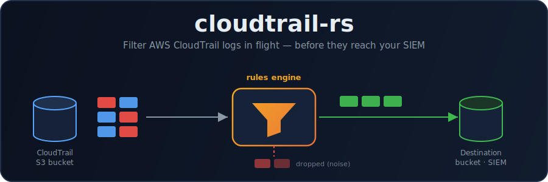
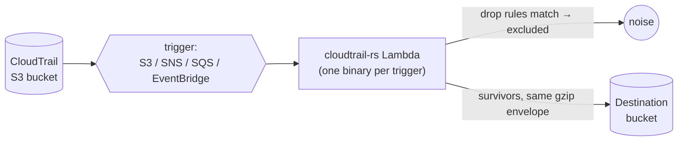

<p align="center">
  
</p>

<p align="center">
  <a href="https://github.com/boogy/cloudtrail-rs/actions/workflows/ci.yml"></a>
  <a href="https://github.com/boogy/cloudtrail-rs/actions/workflows/release.yml"></a>
  <a href="https://hub.docker.com/r/boogy/cloudtrail-rs"></a>
  <a href="LICENSE"></a>
</p>

**Filter AWS CloudTrail logs in flight — before they reach your SIEM.**

`cloudtrail-rs` reads a `.json.gz` CloudTrail object, drops the noisy `Records`
entries that match a configured exclusion rule, and writes the survivors to a
destination bucket with the same `gzip({"Records":[...]})` envelope. Filtering
CloudTrail at the source cuts SIEM ingest cost and noise without touching the
source of truth. It ships as **four independent Lambda binaries** (one per trigger
topology) plus a **local/offline CLI**, built on a hexagonal core with
`#![forbid(unsafe_code)]` in every crate.



## Features

| | |
| --- | --- |
| 🧩 **Hexagonal core** | All filtering logic lives in `cloudtrail-rs-core` with **zero AWS dependencies**; AWS is reached only through object-safe ports. Adding an event source is one decoder behind one Cargo feature — zero changes to core. |
| 🎯 **One decoder per binary** | Each trigger topology is a separate binary compiling in exactly one `EventDecoder` via a feature. No runtime source sniffing, no dead decoder code in the artifact. |
| ⚡ **Fast warm path** | The per-record path is pure computation, no trait dispatch — dispatch happens once per object or once per invocation, not once per record. |
| 🌊 **Streaming or buffered** | Constant-memory streaming with S3 multipart for large objects, in-memory buffering for small ones, `auto` by size. |
| 🔎 **Indexed rules** | Rules are indexed by `eventSource` literal, so a record only checks the rules that could apply to it — per-record cost stays low even with a large ruleset. |
| 🔒 **Minimal, signed images** | Distroless static images (<10 MB), cosign-signed, with build-provenance attestation. |

## How it works

A CloudTrail record is **dropped** when it matches any exclusion rule; a rule
matches when **all** of its conditions match (AND within a rule, OR across rules).
Survivors are re-packed into the same gzip envelope and written to the destination
bucket. Configuration comes from an optional settings file overlaid by `CT_*`
environment variables (env wins); rules come from a separate YAML document loaded
from `file://`, `s3://`, or `ssm://`.

```yaml
# rules.yaml — drop the matching (noisy) records, keep the rest
rules:
  - name: EKS KMS operations
    matches: # AND — all conditions must match
      - field_name: eventSource
        regex: "^kms\\.amazonaws\\.com$"
      - field_name: sourceIPAddress
        regex: "^eks\\.amazonaws\\.com$"
```

See [Rules](docs/rules.md) for the schema and the `always`-bucket optimization,
and [Configuration](docs/configuration.md) for the full `CT_*` reference.

## Quickstart (local, no AWS)

```sh
cargo build --release -p cloudtrail-rs
mkdir -p in out && cp your-cloudtrail-*.json.gz in/
./target/release/cloudtrail-rs filter in/ out/ --rules examples/rules.example.yaml
```

Validate a ruleset (and see which rules aren't index-optimized), or dry-run a rule
against a real sample:

```sh
./target/release/cloudtrail-rs validate examples/rules.example.yaml
./target/release/cloudtrail-rs test examples/rules.example.yaml sample.json.gz
```

See the [CLI reference](docs/cli.md) for `validate` / `test` / `filter`.

## Trigger topologies

Pick the binary that matches how CloudTrail notifies your pipeline:

| Topology                          | Binary               | Feature              |
| --------------------------------- | -------------------- | -------------------- |
| S3 → Lambda (direct notification) | `lambda-s3`          | `decode-s3`          |
| S3 → SNS → Lambda                 | `lambda-sns`         | `decode-sns`         |
| S3 → SQS → Lambda                 | `lambda-sqs`         | `decode-sqs`         |
| S3 → EventBridge → Lambda         | `lambda-eventbridge` | `decode-eventbridge` |

Details, IAM policies, and rollout guidance live in [Deployment](docs/deployment.md).

## Container images

Minimal distroless images are published to **GHCR** and **Docker Hub** for each
module (`lambda-s3`, `lambda-sns`, `lambda-sqs`, `lambda-eventbridge`, `cli`), as
multi-arch manifests (`arm64` + `amd64`), tagged `<module>-<version>` (immutable)
and `<module>-latest`:

```sh
docker pull ghcr.io/boogy/cloudtrail-rs:lambda-s3-latest
```

## Documentation

Full docs live in [`docs/`](docs/README.md).

| Doc                                    | What's in it                                                                          |
| -------------------------------------- | ------------------------------------------------------------------------------------- |
| [Architecture](docs/architecture.md)   | Hexagonal core, crate graph, ports, hot path, buffer-vs-stream, cold-start/init-once. |
| [Configuration](docs/configuration.md) | `SETTINGS_URI`, precedence, full `CT_*` env reference, the YAML quoting trap.         |
| [Rules](docs/rules.md)                 | Rules schema, AND/OR evaluation, the rule index and the `always` bucket.              |
| [Deployment](docs/deployment.md)       | Four topologies, zips + container images, IAM, the SQS data-loss warning, rollout.    |
| [CLI](docs/cli.md)                     | `validate` / `test` / `filter` reference with examples.                               |
| [Development](docs/development.md)      | Commands, Makefile targets, MiniStack tests, CI, the release pipeline.                |

> ⚠️ **SQS users:** `ReportBatchItemFailures` must be enabled on the event source
> mapping, or a partial batch failure becomes **silent, unrecoverable data
> loss**. See [Deployment → SQS](docs/deployment.md#sqs-reportbatchitemfailures-is-not-optional).

## License

Apache-2.0 — see [LICENSE](LICENSE).
