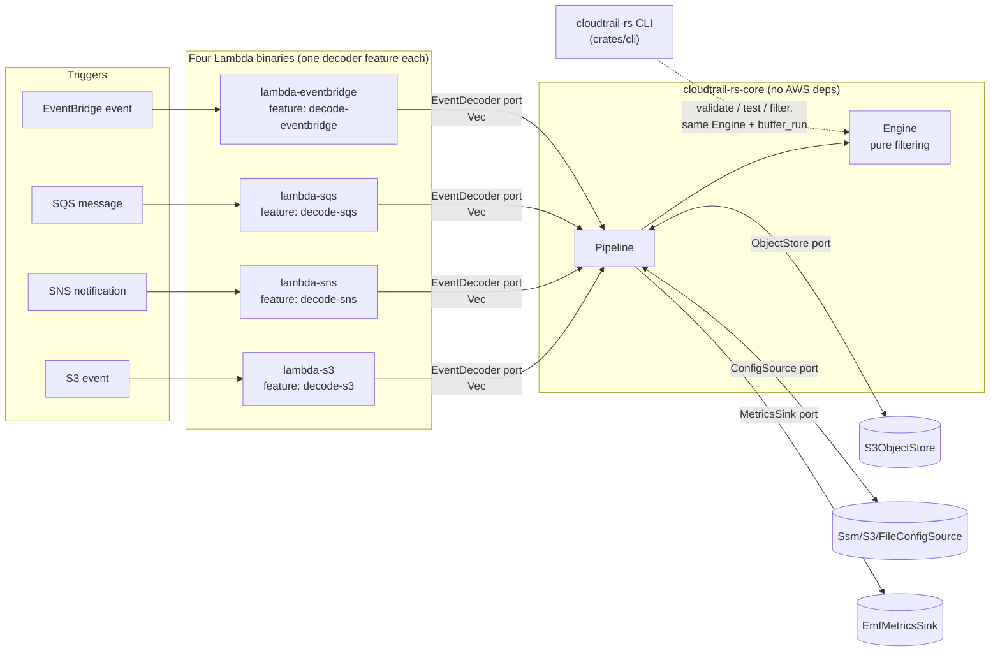

# cloudtrail-rs

A Rust pipeline that filters CloudTrail S3 logs in flight: read a `.json.gz`
CloudTrail object, drop noisy `Records` entries that match a configured
exclusion rule, write the survivors to a destination bucket with the same
`gzip({"Records":[...]})` envelope. Ships as four independent Lambda
binaries (one per trigger topology) plus a local/offline CLI.

## Architecture

Hexagonal core: `cloudtrail-rs-core` owns all filtering logic and defines
four ports as object-safe traits. `cloudtrail-rs-aws` implements the
AWS-backed adapters. Each Lambda binary is a thin composition root that
wires `Arc<dyn Port>` instances into a `Pipeline`. Adding a new event source
is one new `EventDecoder` behind one new Cargo feature and one new bin —
zero changes to `core`.



The per-record hot path is pure computation with no trait dispatch; dispatch
happens once per object (`ObjectStore`) or once per invocation (`ConfigSource`,
`MetricsSink`), never per record.

| Crate | Role |
|---|---|
| `crates/core` (`cloudtrail-rs-core`) | Filtering engine, ports, model, config schema. No `aws-sdk-*` dependency. |
| `crates/aws` (`cloudtrail-rs-aws`) | `S3ObjectStore`, `S3ConfigSource`, `SsmConfigSource` — the AWS-backed port implementations. |
| `crates/lambda-s3` (`cloudtrail-rs-lambda-s3`) | Composition root, S3 → Lambda direct trigger, feature `decode-s3`. |
| `crates/lambda-sns` (`cloudtrail-rs-lambda-sns`) | Composition root, S3 → SNS → Lambda trigger, feature `decode-sns`. |
| `crates/lambda-sqs` (`cloudtrail-rs-lambda-sqs`) | Composition root, S3 → SQS → Lambda trigger, feature `decode-sqs`. |
| `crates/lambda-eventbridge` (`cloudtrail-rs-lambda-eventbridge`) | Composition root, S3 → EventBridge → Lambda trigger, feature `decode-eventbridge`. |
| `crates/cli` (`cloudtrail-rs`) | Offline CLI: `validate`, `test`, `filter`. Depends on `core` **and** `aws` (so a rules/config `uri` can be `ssm://` or `s3://`). |

## The four trigger topologies

Each topology is a **separate binary** compiling in exactly one
`EventDecoder` via a Cargo feature — no runtime source sniffing, no decoder
registry, no dead decoder code in the artifact.

| Topology | Binary | Feature | Notes |
|---|---|---|---|
| S3 → Lambda (direct notification) | `lambda-s3` | `decode-s3` | Lowest latency, no intermediate queue. |
| S3 → SNS → Lambda | `lambda-sns` | `decode-sns` | Fan-out to multiple subscribers possible. |
| S3 → SQS → Lambda | `lambda-sqs` | `decode-sqs` | Buffering/backpressure; returns `batchItemFailures` — see the warning below. |
| S3 → EventBridge → Lambda | `lambda-eventbridge` | `decode-eventbridge` | Rule-based routing; EventBridge object keys are **not** URL-encoded (S3/SNS/SQS-embedded S3 keys are form-urlencoded — `+` decodes to space). |

Build one binary at a time; the feature is additive but only one decoder is
ever wired into a given binary's `main`.

## Environment variables

`SETTINGS_URI` is read at process start to locate an optional settings
document (`file://` resolved by `core` directly; `s3://`/`ssm://` resolved by
the composition root, which links `cloudtrail-rs-aws`). An env-only
deployment — no `SETTINGS_URI` at all — is valid; every field below has a
default and/or a `CT_*` override, and env always wins over the file.

| Variable | Settings path | Meaning | Default |
|---|---|---|---|
| `SETTINGS_URI` | — (bootstrap only) | `file://`, `s3://`, or `ssm://` location of the optional settings YAML document. | none (env-only deployment) |
| `CT_DEST_BUCKET` | `destination.bucket` | Destination bucket for filtered output. **Required** (here or in the file). | — |
| `CT_KEY_PREFIX` | `destination.key_prefix` | Prefix prepended to the source key for the destination key. `""` = identical key. | `""` |
| `CT_SOURCE_INCLUDE_KEY_REGEX` | `source.include_key_regex` | Source key must match this to be processed. | `\.json\.gz$` |
| `CT_SOURCE_EXCLUDE_KEY_REGEX` | `source.exclude_key_regex` | Source key matching this is skipped (digests, Insights, folder markers). | `(/CloudTrail-Digest/|/CloudTrail-Insight/|/$)` |
| `CT_PROCESSING_MODE` | `processing.mode` | `auto` \| `buffer` \| `stream`. | `auto` |
| `CT_STREAM_THRESHOLD_BYTES` | `processing.stream_threshold_bytes` | `auto` mode switches to streaming above this object size. | `8388608` |
| `CT_MAX_OBJECT_BYTES` | `processing.max_object_bytes` | Buffer-mode-only guard on decompressed size. | `134217728` |
| `CT_MULTIPART_PART_BYTES` | `processing.multipart_part_bytes` | Stream-mode S3 multipart part size. | `8388608` |
| `CT_GZIP_LEVEL` | `processing.gzip_level` | Output gzip compression level. | `6` |
| `CT_DRY_RUN` | `behavior.dry_run` | Evaluate and count, but forward every record untouched. | `false` |
| `CT_ON_CONFIG_ERROR` | `behavior.on_config_error` | `open` \| `closed` when the rules doc has never loaded successfully. | `open` |
| `CT_ON_MISSING_OBJECT` | `behavior.on_missing_object` | `error` \| `skip` when the source object is gone. | `error` |
| `CT_ON_UNRECOGNIZED_OBJECT` | `behavior.on_unrecognized_object` | `copy` \| `skip` \| `error` for JSON with no `Records` array. | `copy` |
| `CT_PARTIAL_BATCH_FAILURES` | `behavior.partial_batch_failures` | SQS only — `true` returns `batchItemFailures` for just the failed items; `false` fails the whole batch. | `true` |
| `CT_SQS_BODY_FORMAT` | `sqs.body_format` | `auto` \| `s3` \| `sns` — set explicitly to skip the SQS body-shape sniff. | `auto` |
| `CT_RULES_URI` | `rules.uri` | `ssm://` \| `s3://` \| `file://` location of the exclusion-rules document. | `s3://sec-config/cloudtrail/rules.yaml` |
| `CT_RULES_TTL_SECONDS` | `rules.ttl_seconds` | Cache TTL before revalidating the rules document. | `300` |
| `CT_METRICS` | `observability.metrics` | `emf` \| `none`. | `emf` |
| `CT_METRICS_NAMESPACE` | `observability.namespace` | CloudWatch EMF namespace. | `cloudtrail-rs` |
| `CT_LOG_LEVEL` | `observability.log_level` | Log verbosity. | `info` |

`version: 1` (a plain integer, not semver) is the only settings field with no
env override — it is a schema marker, not a runtime knob.

## Required IAM actions

Every binary needs these three, regardless of topology (confirmed against
the SDK calls the adapters actually make in `crates/aws/src/*.rs`):

**Source bucket (read):**
```json
{ "Effect": "Allow", "Action": "s3:GetObject", "Resource": "arn:aws:s3:::SOURCE_BUCKET/*" }
```

**Destination bucket (write, including stream-mode multipart):**
```json
{
  "Effect": "Allow",
  "Action": [
    "s3:PutObject",
    "s3:CreateMultipartUpload",
    "s3:UploadPart",
    "s3:CompleteMultipartUpload",
    "s3:AbortMultipartUpload"
  ],
  "Resource": "arn:aws:s3:::DEST_BUCKET/*"
}
```

**Rules/config source (read) — matches whichever scheme `CT_RULES_URI` uses:**
```json
// ssm://path/to/param  (SsmConfigSource calls GetParameter for both fetch and version-check)
{ "Effect": "Allow", "Action": "ssm:GetParameter", "Resource": "arn:aws:ssm:REGION:ACCOUNT:parameter/path/to/param" }
```
```json
// s3://bucket/key.yaml  (S3ConfigSource: HeadObject for the cheap ETag re-check, GetObject to fetch)
{ "Effect": "Allow", "Action": ["s3:GetObject", "s3:HeadObject"], "Resource": "arn:aws:s3:::CONFIG_BUCKET/key.yaml" }
```
`file://` needs no IAM grant — it is a local path, used by the CLI and tests, never by a deployed Lambda.

**SQS-triggered binary only** — the event source mapping polls the queue
under the execution role, so the role also needs:
```json
{
  "Effect": "Allow",
  "Action": ["sqs:ReceiveMessage", "sqs:DeleteMessage", "sqs:GetQueueAttributes"],
  "Resource": "arn:aws:sqs:REGION:ACCOUNT:QUEUE_NAME"
}
```

Standard Lambda basic-execution logging (`logs:CreateLogGroup`,
`logs:CreateLogStream`, `logs:PutLogEvents`) is also required for EMF
metrics to reach CloudWatch, as with any Lambda function.

The CLI's `filter`/`validate` S3 and SSM paths need the same read/write
actions above, scoped to whatever bucket/prefix or parameter you point it
at, under whatever credentials are active in your environment.

## Build

```sh
cargo install cargo-lambda
cargo lambda build --release --arm64 -p cloudtrail-rs-lambda-s3
# repeat -p for lambda-sns / lambda-sqs / lambda-eventbridge
```

Target: `aarch64-unknown-linux-musl`. Runtime: `provided.al2023`. The AWS
SDK connector uses rustls with the **`ring`** crypto provider (see
`crates/aws/src/http_client.rs`), not the default `aws-lc-rs` — `aws-lc-rs`
needs a working C toolchain for the musl cross-build and is the usual cause
of a build that succeeds locally and fails only in CI. The workspace's
release profile (`lto = "fat"`, `codegen-units = 1`, `panic = "abort"`,
`strip = "symbols"`) is set in the root `Cargo.toml` and trims cold-start
binary size.

The CLI is a normal host binary, no `cargo lambda` needed:

```sh
cargo build --release -p cloudtrail-rs
```

## Rollout guidance

1. Deploy with `CT_DRY_RUN=true`. Every record is still evaluated and
   counted, but nothing is dropped — the pipeline forwards everything.
2. Watch the `RecordsDropped` EMF metric (namespace `CT_METRICS_NAMESPACE`,
   default `cloudtrail-rs`) against `RecordsIn` for a representative window.
   Cross-check against per-rule `RuleDrops` (dimension `Rule`) to confirm
   the rules that are supposed to be firing are the ones actually firing.
3. Once the drop rate and the rules responsible for it look correct, flip
   `CT_DRY_RUN=false` (or remove the override) to start actually excluding
   records.

Other metrics worth alarming on: `ParseErrors` and `ConfigLoadErrors` (both
should normally be 0 or near-0), `ColdStart` (expected non-zero rate, not a
problem by itself), `ObjectsSkipped`/`UnrecognizedObjects` (sanity-check
against expected traffic shape).

## ⚠️ SQS: `ReportBatchItemFailures` is not optional

`lambda-sqs` returns `{"batchItemFailures":[...]}` built from the pipeline's
per-object failures, so the event source mapping re-drives only the
messages that actually failed. **If `ReportBatchItemFailures` is not
enabled on the event source mapping, this response is silently ignored**
and Lambda deletes the *entire* batch on any `Ok` return — including the
messages whose objects failed to process. That is silent, unrecoverable
data loss: the source object is never retried and nothing shows up as an
error.

If you cannot enable `ReportBatchItemFailures` on the mapping for some
reason, set `CT_PARTIAL_BATCH_FAILURES=false` (`behavior.partial_batch_failures:
false`). This fails the **whole batch** on any single-item failure instead
of silently discarding a partial one — worse throughput under errors, but
no silent loss. `partial_batch_failures: true` (the default) is only safe
when `ReportBatchItemFailures` is actually enabled on the mapping.

## Cold start and init-once

Rust has no `init()` phase like Go, but Lambda gives the same window:
everything in `main()` before `lambda_runtime::run(...)` runs once per
container, on a full-vCPU burst, and is skipped on every warm invocation
after that (and under provisioned concurrency, essentially never runs
again for the container's lifetime). What each binary's `main` does in that
window, in order:

1. `init_tracing()` — sets up the `tracing_subscriber` JSON registry (must
   happen exactly once; re-initializing per-invocation panics or double-logs).
2. `Settings::load()` — parses `SETTINGS_URI` (if any) plus every `CT_*` env
   var, once.
3. `aws_config::load_defaults(...)` — resolves the credential chain once
   (container-credential HTTP call).
4. `S3ObjectStore::new(&sdk_conf)` — builds the S3 client and its TLS
   connection pool (rustls/ring handshake cost paid once, not per object).
5. The one compiled-in `EventDecoder` is constructed.
6. The `ConfigSource` matching `rules.uri`'s scheme is built.
7. `Metrics::default()` — process-lived atomic counters, held across
   invocations by `Arc`.
8. The `MetricsSink` (`EmfMetricsSink` or `NoopMetricsSink`) is built from
   `observability.metrics`.
9. `ConfigStore::new(...)` is constructed, then `cfg_store.prime().await` —
   fetches, parses, and **compiles every regex plus the rule index** exactly
   once, and seeds the TTL clock so the first real invocation doesn't
   re-fetch what init just loaded. `prime()` never panics or returns an
   error even on failure — it records `ConfigLoadErrors` and lets the first
   invocation's `on_config_error` policy handle it. Only a *settings* load
   failure is fatal at this stage (a bad `SETTINGS_URI` is a deployment
   error, not a transient one).
10. `Pipeline::new(...)` wires all of the above into one `Arc<Pipeline>`.

Everything above is easily tens to a couple hundred milliseconds
(regex compilation across ~80 patterns is the single largest line item;
TLS handshake and the rules fetch are next). A warm invocation instead pays
only the per-record filtering cost — pure computation, no trait dispatch,
no I/O beyond one `GetObject`/`PutObject` pair. `ColdStart: 1` is emitted
(an `AtomicBool` flipped on the first `handle()` call in the process) so a
cold start is visible in p99 latency instead of being confused with a
genuinely large object. Provisioned concurrency pays for itself precisely
when cold-start latency (not average latency) is what you're bounding —
e.g. a strict per-invocation SLA — since it keeps containers pre-initialized
past the point this whole section describes.

**Hard rule: every adapter (`ObjectStore`, `ConfigSource`, decoder,
`MetricsSink`) is constructed in `main`, during init — never inside the
handler closure.** The closure passed to `service_fn` captures only
`pipeline.clone()` (an `Arc` clone) and calls `pipeline.handle(...)`. A
`::new(` call for any port implementation inside that closure is a bug: it
would silently repeat regex compilation, credential resolution, or client
construction on every single invocation instead of once per container.

## `validate` and the `always` bucket

The rule index extracts literal `eventSource` values from each rule
(`^kms\.amazonaws\.com$` → one literal, `^(cloudwatch|logs|ec2)\.amazonaws\.com$`
→ three) so that filtering a record only checks the rules that could
possibly apply to its `eventSource`, instead of every rule. Extraction is
conservative: inline flags (`(?i)`), character classes, quantifiers, nested
groups, non-anchored patterns, or **no `eventSource` condition at all** all
fall into a catch-all `always` bucket that is checked against *every*
record, defeating the optimization for that rule.

`cloudtrail-rs validate <rules-uri>` prints a warning naming every rule that
landed in `always` — that warning is your lever to get the speedup back.
To fix a rule the warning flags:

```yaml
# Falls into `always`: no anchors, index extraction gives up.
- name: KMS operations
  matches:
    - field_name: eventSource
      regex: "kms.amazonaws.com"

# Indexed: a single anchored literal.
- name: KMS operations
  matches:
    - field_name: eventSource
      regex: "^kms\\.amazonaws\\.com$"

# Also indexed: an anchored literal alternation.
- name: Monitoring services
  matches:
    - field_name: eventSource
      regex: "^(cloudwatch|logs|ec2)\\.amazonaws\\.com$"
```

Rules with no `eventSource` match at all (filtering purely on `eventName`,
`userIdentity.*`, etc.) are legitimate and will always land in `always` —
the warning is informational there, not necessarily something to fix.

## The YAML quoting trap

Rules and settings are YAML, and YAML's escaping rules depend on the
scalar style. This bites hardest with `\d`, `\.`, and friends inside a rule
`regex`:

```yaml
# CORRECT — double-quoted scalar: YAML unescapes \\ to \, giving the
# 2-character regex \d (Rust regex: "a digit").
- field_name: requestParameters.roleSessionName
  regex: "^session-\\d+$"

# WRONG — single-quoted (or a bare/plain) scalar: YAML does NOT interpret
# backslash escapes here, so the regex engine receives the 4 literal
# characters \\d — which matches a literal backslash followed by "d", never
# a digit. This rule will never fire on real session names.
- field_name: requestParameters.roleSessionName
  regex: '^session-\\d+$'
```

Rule of thumb: write regex patterns in **double-quoted** YAML scalars and
double every backslash you want the regex engine to see once
(`\\.` → `\.`, `\\d` → `\d`). `cloudtrail-rs test` against a real sample is
the fastest way to catch a rule that silently never matches.

## CLI (`cloudtrail-rs`, `crates/cli`)

Local/offline companion to the Lambda binaries — same `Engine` and
`core::process::buffer_run`, no Lambda runtime involved. A rules/config
`uri` accepts `ssm://`, `s3://`, `file://`, or a bare local path (no
`scheme://` at all — read straight off disk, the ergonomic case for
`examples/rules.example.yaml`).

```sh
cargo build --release -p cloudtrail-rs
# binary at target/release/cloudtrail-rs
```

### `validate <uri>`

Builds the `Engine` from the rules document, prints rule/pattern counts,
and warns (to stderr, non-fatally) about every rule the index could not
anchor by `eventSource` (see "`validate` and the `always` bucket" above).
Exit code is non-zero **only** on an actual config/build error (bad YAML,
invalid semver, unresolvable regex, duplicate rule name, empty `matches`,
etc.) — this is what CI should gate on.

```sh
cloudtrail-rs validate examples/rules.example.yaml
# 25 rules, 81 patterns compiled
# warning: rule "IAM Session Renewals" not indexed by eventSource (no eventSource condition): checked against every record
# warning: rule "AWS Config Recorder" not indexed by eventSource (pattern ".*\.amazonaws\.com$" could not be reduced to a fixed set of literals): checked against every record
# warning: rule "Automated Tool Describe Operations" not indexed by eventSource (no eventSource condition): checked against every record
echo $?   # 0
```

### `test <rules> <sample.json.gz>`

Evaluates every record in a decompressed CloudTrail sample against the
compiled ruleset and reports KEEP/DROP (with the dropping rule's name) per
record, plus a kept/dropped summary — useful for spotting a rule that
never fires (a YAML-quoting bug, a typo'd `field_name`, etc.) before it
ships.

```sh
cloudtrail-rs test examples/rules.example.yaml sample-cloudtrail-log.json.gz
# KEEP  record 1
# DROP  record 2 (rule: "EKS KMS Operations")
# ...
# summary: 500 records, 420 kept (84.0%), 80 dropped (16.0%)
```

### `filter <source> <dest> --rules <uri>`

Filters CloudTrail gzip objects through the exact same `buffer_run` the
Lambda binaries use. `source` and `dest` are each independently
auto-detected:

- a **local file** — `source` filters that one object to `dest` (a file path);
- a **local directory** — every `.json.gz` under it is filtered, mirroring
  each object's relative path into `dest` (a directory, created as needed);
- an **`s3://bucket/prefix`** — every `.json.gz` under that prefix is
  filtered, batch-style, same as a local directory.

Output is always gzip-faithful `.json.gz` with the canonical
`application/x-gzip` / `gzip` content-type and content-encoding. Objects
where every record is dropped are **not written** ("zero empty writes") —
neither locally nor to S3. Any S3-side `source`/`dest` needs AWS
credentials resolved the normal SDK way (env, profile, instance role, …).

**Local → local (see filtering happen with plain folders, no AWS needed):**
```sh
mkdir -p in out
cp cloudtrail-sample-*.json.gz in/
cloudtrail-rs filter in/ out/ --rules examples/rules.example.yaml
#   a.json.gz -> out/a.json.gz
#   b.json.gz -> (all records dropped, nothing written)
# processed 2 object(s): 1 written, 1 fully dropped, 0 copied verbatim
# records: 4 in, 2 kept, 2 dropped
```

**Local → S3:**
```sh
cloudtrail-rs filter in/ s3://ct-siem-sync/backfill/ --rules examples/rules.example.yaml
```

**S3 → local** (pull, filter, and inspect a prefix without writing back to AWS):
```sh
cloudtrail-rs filter s3://raw-cloudtrail-bucket/AWSLogs/ ./filtered/ \
  --rules ssm:///cloudtrail-rs/rules
```

**Single file → single file:**
```sh
cloudtrail-rs filter sample.json.gz filtered.json.gz --rules examples/rules.example.yaml
```

## Integration tests (MiniStack)

`crates/aws` and other crates have `#[ignore]`d tests that exercise the
real AWS SDK calls against [MiniStack](https://github.com/ministack-org/ministack)
(a local S3/SSM-compatible stack) instead of mocks. Bring it up first:

```sh
docker compose -f docker-compose.test.yml up -d
cargo test --workspace -- --ignored
```

## Development

```sh
cargo test --workspace --all-features
cargo clippy --workspace --all-targets --all-features -- -D warnings
cargo fmt --check
```

Every crate is `#![forbid(unsafe_code)]`; `core` has zero `aws-sdk-*`
dependencies by design — the hexagonal boundary is enforced by the crate
graph, not just convention.
