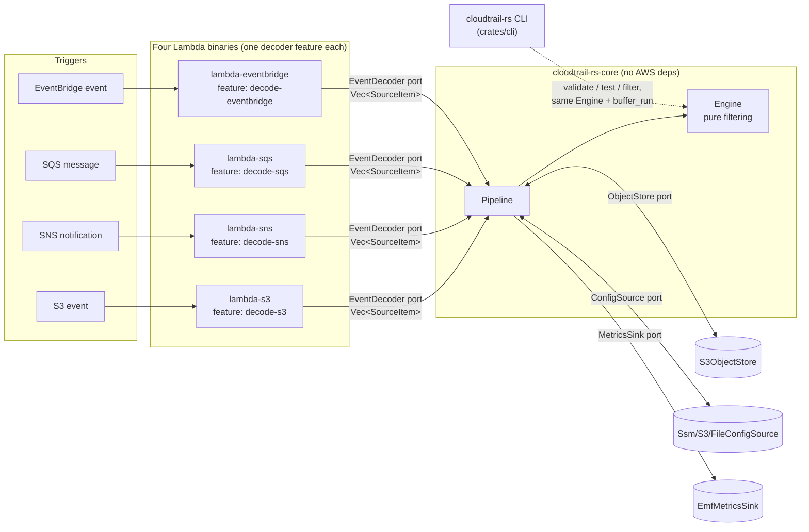
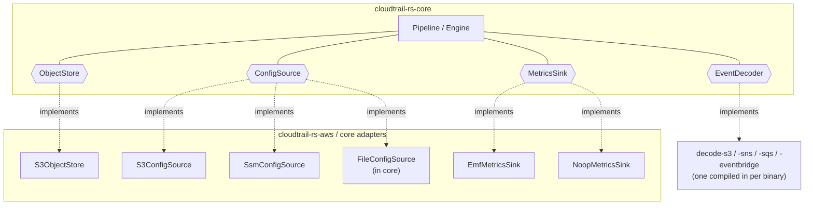
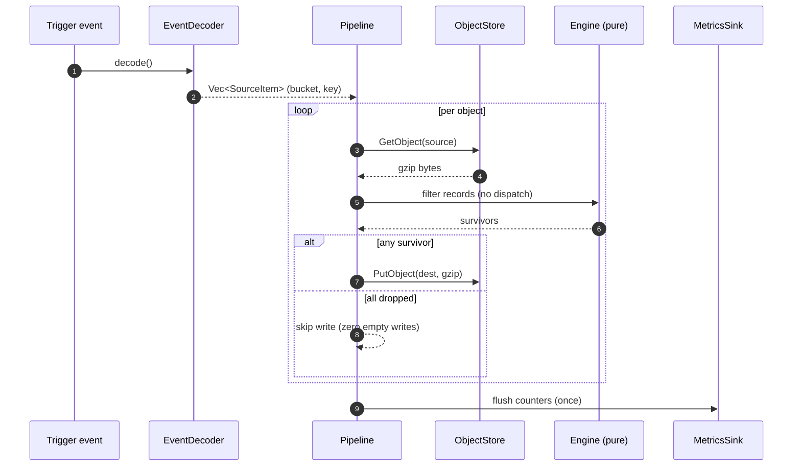
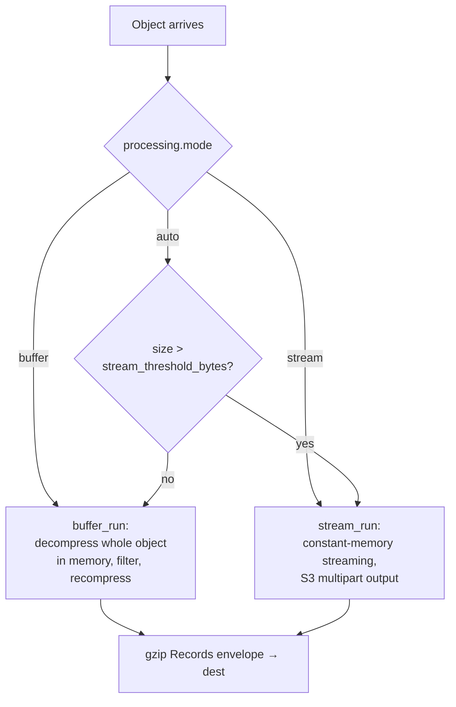
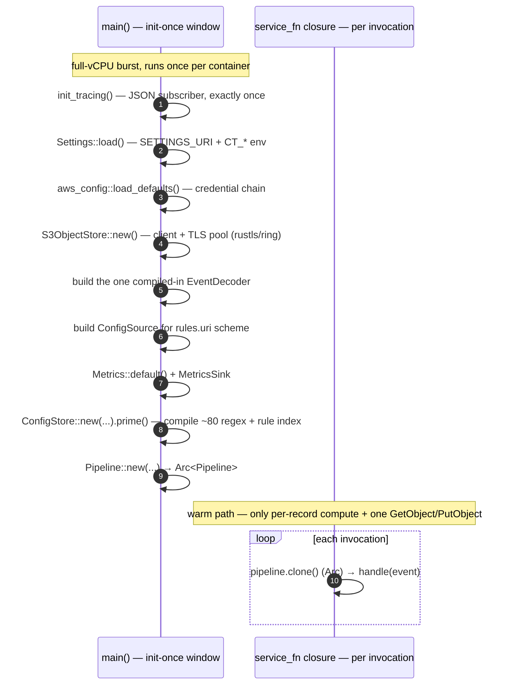

# Architecture

`cloudtrail-rs` is a **hexagonal (ports-and-adapters)** system. All filtering
logic lives in a pure core crate with no AWS dependency; the AWS world reaches
it only through a small set of object-safe traits (ports). Each deployable is a
thin composition root that wires concrete adapters into the core.

- [The crate graph](#the-crate-graph)
- [Ports](#ports)
- [The per-record hot path](#the-per-record-hot-path)
- [Processing modes: buffer vs stream](#processing-modes-buffer-vs-stream)
- [Cold start and init-once](#cold-start-and-init-once)

## The crate graph

Adding a new event source is one new `EventDecoder` behind one new Cargo feature
and one new bin — **zero changes to `core`**.

| Crate                                                            | Role                                                                                                                             |
| ---------------------------------------------------------------- | -------------------------------------------------------------------------------------------------------------------------------- |
| `crates/core` (`cloudtrail-rs-core`)                             | Filtering engine, ports, model, config schema. No `aws-sdk-*` dependency.                                                        |
| `crates/aws` (`cloudtrail-rs-aws`)                               | `S3ObjectStore`, `S3ConfigSource`, `SsmConfigSource` — the AWS-backed port implementations.                                      |
| `crates/lambda-s3` (`cloudtrail-rs-lambda-s3`)                   | Composition root, S3 → Lambda direct trigger, feature `decode-s3`.                                                               |
| `crates/lambda-sns` (`cloudtrail-rs-lambda-sns`)                 | Composition root, S3 → SNS → Lambda trigger, feature `decode-sns`.                                                               |
| `crates/lambda-sqs` (`cloudtrail-rs-lambda-sqs`)                 | Composition root, S3 → SQS → Lambda trigger, feature `decode-sqs`.                                                               |
| `crates/lambda-eventbridge` (`cloudtrail-rs-lambda-eventbridge`) | Composition root, S3 → EventBridge → Lambda trigger, feature `decode-eventbridge`.                                               |
| `crates/cli` (`cloudtrail-rs`)                                   | Offline CLI: `validate`, `test`, `filter`. Depends on `core` **and** `aws` (so a rules/config `uri` can be `ssm://` or `s3://`). |

Every crate is `#![forbid(unsafe_code)]`; `core` has zero `aws-sdk-*`
dependencies by design — the hexagonal boundary is enforced by the crate graph,
not just convention.

## Ports

The core defines four ports as object-safe traits. The Pipeline holds
`Arc<dyn Port>` instances and never knows which concrete adapter is behind them.

| Port           | Responsibility                                                    | Adapters                                                 |
| -------------- | ----------------------------------------------------------------- | -------------------------------------------------------- |
| `EventDecoder` | Turn a trigger event into `Vec<SourceItem>` (bucket + key pairs). | One per topology, feature-gated.                         |
| `ObjectStore`  | `GetObject` / `PutObject` (+ multipart for stream mode).          | `S3ObjectStore`.                                         |
| `ConfigSource` | Fetch the rules document + a cheap version/ETag re-check.         | `S3ConfigSource`, `SsmConfigSource`, `FileConfigSource`. |
| `MetricsSink`  | Emit counters (EMF or drop).                                      | `EmfMetricsSink`, `NoopMetricsSink`.                     |

## The per-record hot path

The per-record hot path is **pure computation with no trait dispatch**. Dispatch
happens once per object (`ObjectStore`) or once per invocation (`ConfigSource`,
`MetricsSink`), never per record.

## Processing modes: buffer vs stream

`CT_PROCESSING_MODE` selects how each object is processed. `auto` (default)
switches to streaming above `CT_STREAM_THRESHOLD_BYTES` (8 MiB default).

- **buffer** — decompresses the whole object into memory. Guarded by
  `CT_MAX_OBJECT_BYTES` (128 MiB default) on the decompressed size. Used by the
  CLI's `filter`/`test` as well.
- **stream** — constant memory; writes the destination with S3 multipart uploads
  of `CT_MULTIPART_PART_BYTES` (8 MiB default) each.

## Cold start and init-once

Rust has no `init()` phase like Go, but Lambda gives the same window: everything
in `main()` before `lambda_runtime::run(...)` runs **once per container**, on a
full-vCPU burst, and is skipped on every warm invocation after that (and under
provisioned concurrency, essentially never runs again for the container's
lifetime).

What `main` does in that window, in order:

1. `init_tracing()` — sets up the `tracing_subscriber` JSON registry (must happen
   exactly once; re-initializing per-invocation panics or double-logs).
2. `Settings::load()` — parses `SETTINGS_URI` (if any) plus every `CT_*` env var, once.
3. `aws_config::load_defaults(...)` — resolves the credential chain once.
4. `S3ObjectStore::new(&sdk_conf)` — builds the S3 client and its TLS connection
   pool (rustls/ring handshake cost paid once, not per object).
5. The one compiled-in `EventDecoder` is constructed.
6. The `ConfigSource` matching `rules.uri`'s scheme is built.
7. `Metrics::default()` — process-lived atomic counters, held across invocations by `Arc`.
8. The `MetricsSink` (`EmfMetricsSink` or `NoopMetricsSink`) is built from `observability.metrics`.
9. `ConfigStore::new(...)` then `cfg_store.prime().await` — fetches, parses, and
   **compiles every regex plus the rule index** exactly once, and seeds the TTL
   clock. `prime()` never panics or returns an error even on failure — it records
   `ConfigLoadErrors` and lets the first invocation's `on_config_error` policy
   handle it. Only a _settings_ load failure is fatal at this stage (a bad
   `SETTINGS_URI` is a deployment error, not a transient one).
10. `Pipeline::new(...)` wires all of the above into one `Arc<Pipeline>`.

Regex compilation across ~80 patterns is the single largest init line item; the
TLS handshake and the rules fetch are next — together tens to a couple hundred
milliseconds. `ColdStart: 1` is emitted (an `AtomicBool` flipped on the first
`handle()` call) so a cold start is visible in p99 latency instead of being
confused with a genuinely large object.

> **Hard rule:** every adapter (`ObjectStore`, `ConfigSource`, decoder,
> `MetricsSink`) is constructed in `main`, during init — **never** inside the
> handler closure. The closure passed to `service_fn` captures only
> `pipeline.clone()` (an `Arc` clone). A `::new(` call for any port
> implementation inside that closure is a bug: it would silently repeat regex
> compilation, credential resolution, or client construction on every single
> invocation instead of once per container.

Provisioned concurrency pays for itself precisely when cold-start latency (not
average latency) is what you're bounding — e.g. a strict per-invocation SLA —
since it keeps containers pre-initialized past the point this section describes.

---

See also: [Configuration](configuration.md) · [Rules](rules.md) · [Deployment](deployment.md)
