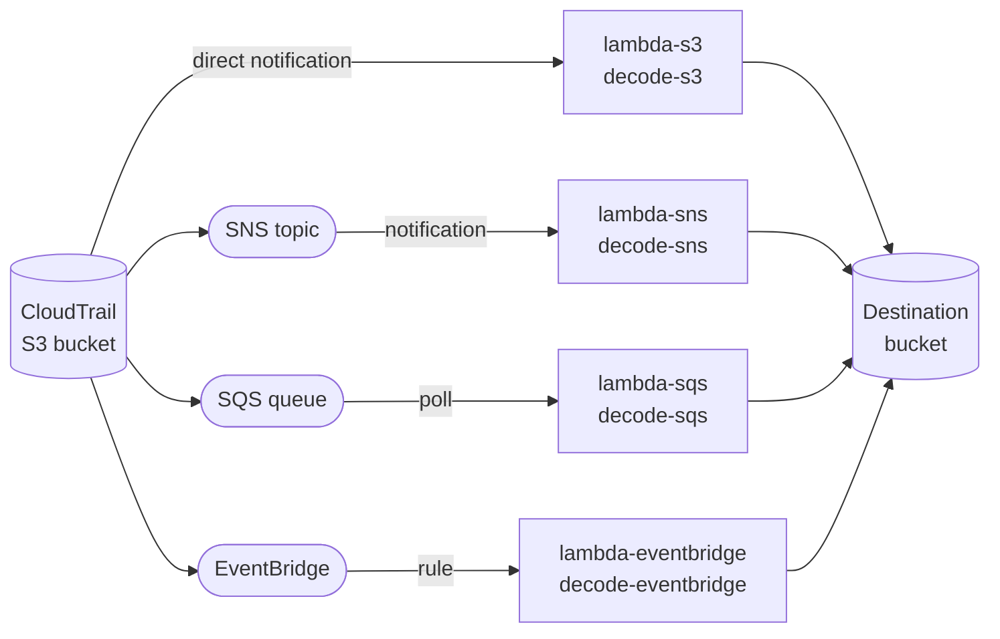
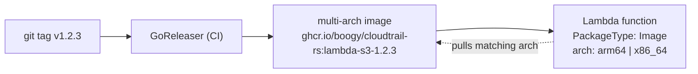
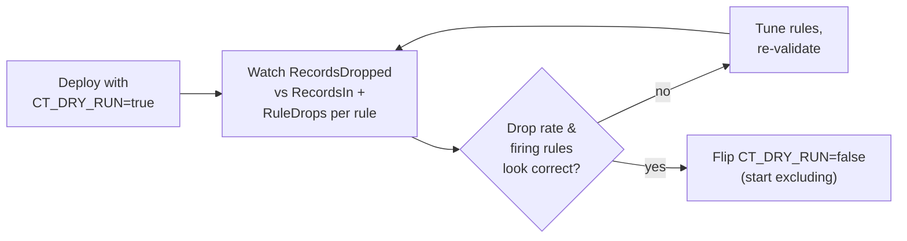

# Deployment

How to build the artifacts, pick a trigger topology, grant IAM, and roll out
safely.

- [The four trigger topologies](#the-four-trigger-topologies)
- [Build: Lambda zip](#build-lambda-zip)
- [Build: container images](#build-container-images)
- [Deploying a container image to Lambda](#deploying-a-container-image-to-lambda)
- [Required IAM actions](#required-iam-actions)
- [SQS: `ReportBatchItemFailures` is not optional](#sqs-reportbatchitemfailures-is-not-optional)
- [Rollout guidance](#rollout-guidance)

## The four trigger topologies

Each topology is a **separate binary** compiling in exactly one `EventDecoder`
via a Cargo feature — no runtime source sniffing, no decoder registry, no dead
decoder code in the artifact.



| Topology                          | Binary               | Feature              | Notes                                                                                                                                         |
| --------------------------------- | -------------------- | -------------------- | --------------------------------------------------------------------------------------------------------------------------------------------- |
| S3 → Lambda (direct notification) | `lambda-s3`          | `decode-s3`          | Lowest latency, no intermediate queue.                                                                                                        |
| S3 → SNS → Lambda                 | `lambda-sns`         | `decode-sns`         | Fan-out to multiple subscribers possible.                                                                                                     |
| S3 → SQS → Lambda                 | `lambda-sqs`         | `decode-sqs`         | Buffering/backpressure; returns `batchItemFailures` — see the [warning below](#sqs-reportbatchitemfailures-is-not-optional).                  |
| S3 → EventBridge → Lambda         | `lambda-eventbridge` | `decode-eventbridge` | Rule-based routing; EventBridge object keys are **not** URL-encoded (S3/SNS/SQS-embedded S3 keys are form-urlencoded — `+` decodes to space). |

Build one binary at a time; the feature is additive but only one decoder is ever
wired into a given binary's `main`.

## Build: Lambda zip

```sh
cargo install cargo-lambda
cargo lambda build --release --arm64 -p cloudtrail-rs-lambda-s3
# repeat -p for lambda-sns / lambda-sqs / lambda-eventbridge
```

Target: `aarch64-unknown-linux-musl`. Runtime: `provided.al2023`.

> **The `aws-lc-rs` vs `ring` gotcha.** The AWS SDK connector uses rustls with
> the **`ring`** crypto provider (see `crates/aws/src/http_client.rs`), _not_ the
> default `aws-lc-rs`. `aws-lc-rs` needs a working C toolchain for the musl
> cross-build and is the usual cause of a build that succeeds locally and fails
> only in CI. Keep `ring`.

The workspace's release profile (`lto = "fat"`, `codegen-units = 1`,
`panic = "abort"`, `strip = "symbols"`) is set in the root `Cargo.toml` and trims
cold-start binary size.

The CLI is a normal host binary, no `cargo lambda` needed:

```sh
cargo build --release -p cloudtrail-rs
```

The release pipeline builds both musl arches (`aarch64` and `x86_64`) for all
four lambdas and the CLI via GoReleaser — see
[development.md](development.md#release-process).

## Build: container images

The release pipeline also publishes minimal container images (one per module) to
GHCR and Docker Hub. Because Rust's `lambda_runtime` crate speaks the Lambda
Runtime API directly, the images use `gcr.io/distroless/static-debian12` (~2 MB)
rather than the ~40 MB `public.ecr.aws/lambda/provided:al2023` base — a static
musl `bootstrap` runs on distroless/static (which ships CA certs for S3/SSM TLS;
the Runtime API endpoint is localhost HTTP). Final images are typically <10 MB:
base + one stripped static binary.

```sh
# multi-arch manifest; Lambda pulls the arch matching the function
docker pull ghcr.io/boogy/cloudtrail-rs:lambda-s3-latest
```

Images are published for `lambda-s3`, `lambda-sns`, `lambda-sqs`,
`lambda-eventbridge`, and the `cli`. Tags: `<module>-<version>` (immutable) and
`<module>-latest` (moved only on non-prerelease tags).

## Deploying a container image to Lambda



Create the function with `--package-type Image` and point `--code
ImageUri=…@<digest>` at the module image; the multi-arch manifest lets Lambda
pull the arch matching the function's `--architectures`. Set the `CT_*` env vars
(at minimum `CT_DEST_BUCKET`) on the function. Zip deploys use the `bootstrap`
zip artifact from the GitHub Release instead.

## Required IAM actions

Every binary needs these three, regardless of topology (confirmed against the SDK
calls the adapters actually make in `crates/aws/src/*.rs`):

**Source bucket (read):**

```json
{
  "Effect": "Allow",
  "Action": "s3:GetObject",
  "Resource": "arn:aws:s3:::SOURCE_BUCKET/*"
}
```

**Destination bucket (write, including stream-mode multipart):**

```json
{
  "Effect": "Allow",
  "Action": [
    "s3:PutObject",
    "s3:CreateMultipartUpload",
    "s3:UploadPart",
    "s3:CompleteMultipartUpload",
    "s3:AbortMultipartUpload"
  ],
  "Resource": "arn:aws:s3:::DEST_BUCKET/*"
}
```

**Rules/config source (read) — matches whichever scheme `CT_RULES_URI` uses:**

```json
// ssm://path/to/param  (SsmConfigSource calls GetParameter for both fetch and version-check)
{
  "Effect": "Allow",
  "Action": "ssm:GetParameter",
  "Resource": "arn:aws:ssm:REGION:ACCOUNT:parameter/path/to/param"
}
```

```json
// s3://bucket/key.yaml  (S3ConfigSource: HeadObject for the cheap ETag re-check, GetObject to fetch)
{
  "Effect": "Allow",
  "Action": ["s3:GetObject", "s3:HeadObject"],
  "Resource": "arn:aws:s3:::CONFIG_BUCKET/key.yaml"
}
```

`file://` needs no IAM grant — it is a local path, used by the CLI and tests,
never by a deployed Lambda.

**SQS-triggered binary only** — the event source mapping polls the queue under
the execution role, so the role also needs:

```json
{
  "Effect": "Allow",
  "Action": [
    "sqs:ReceiveMessage",
    "sqs:DeleteMessage",
    "sqs:GetQueueAttributes"
  ],
  "Resource": "arn:aws:sqs:REGION:ACCOUNT:QUEUE_NAME"
}
```

Standard Lambda basic-execution logging (`logs:CreateLogGroup`,
`logs:CreateLogStream`, `logs:PutLogEvents`) is also required for EMF metrics to
reach CloudWatch, as with any Lambda function.

The CLI's `filter`/`validate` S3 and SSM paths need the same read/write actions
above, scoped to whatever bucket/prefix or parameter you point it at, under
whatever credentials are active in your environment.

## SQS: `ReportBatchItemFailures` is not optional

> ⚠️ **This is silent, unrecoverable data loss if misconfigured.**

`lambda-sqs` returns `{"batchItemFailures":[...]}` built from the pipeline's
per-object failures, so the event source mapping re-drives only the messages that
actually failed. **If `ReportBatchItemFailures` is not enabled on the event
source mapping, this response is silently ignored** and Lambda deletes the
_entire_ batch on any `Ok` return — including the messages whose objects failed
to process. That is silent, unrecoverable data loss: the source object is never
retried and nothing shows up as an error.

If you cannot enable `ReportBatchItemFailures` on the mapping for some reason, set
`CT_PARTIAL_BATCH_FAILURES=false` (`behavior.partial_batch_failures: false`).
This fails the **whole batch** on any single-item failure instead of silently
discarding a partial one — worse throughput under errors, but no silent loss.
`partial_batch_failures: true` (the default) is only safe when
`ReportBatchItemFailures` is actually enabled on the mapping.

## Rollout guidance



1. Deploy with `CT_DRY_RUN=true`. Every record is still evaluated and counted,
   but nothing is dropped — the pipeline forwards everything.
2. Watch the `RecordsDropped` EMF metric (namespace `CT_METRICS_NAMESPACE`,
   default `cloudtrail-rs`) against `RecordsIn` for a representative window.
   Cross-check against per-rule `RuleDrops` (dimension `Rule`) to confirm the
   rules that are supposed to be firing are the ones actually firing.
3. Once the drop rate and the rules responsible for it look correct, flip
   `CT_DRY_RUN=false` (or remove the override) to start actually excluding
   records.

Other metrics worth alarming on: `ParseErrors` and `ConfigLoadErrors` (both
should normally be 0 or near-0), `ColdStart` (expected non-zero rate, not a
problem by itself), `ObjectsSkipped`/`UnrecognizedObjects` (sanity-check against
expected traffic shape).

---

See also: [Configuration](configuration.md) · [Architecture](architecture.md) · [Development](development.md)
