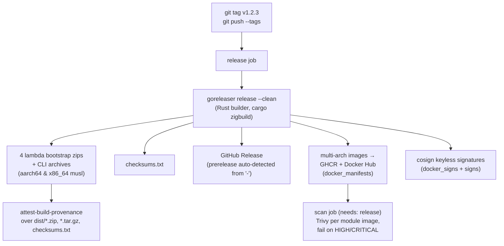

# Development

- [Everyday commands](#everyday-commands)
- [Makefile targets](#makefile-targets)
- [Integration tests (MiniStack)](#integration-tests-ministack)
- [CI](#ci)
- [Release process](#release-process)
- [Required repo secrets](#required-repo-secrets)
- [Contributing](#contributing)

## Everyday commands

```sh
cargo test --workspace --all-features
cargo clippy --workspace --all-targets --all-features -- -D warnings
cargo fmt --check
```

Every crate is `#![forbid(unsafe_code)]`; `core` has zero `aws-sdk-*`
dependencies by design — the hexagonal boundary is enforced by the crate graph,
not just convention.

First-time setup installs every dev/release tool and the musl cross-targets:

```sh
make install-tools
```

## Makefile targets

`make` (or `make help`) lists them all. The full set:

| Target                            | What it does                                                                   |
| --------------------------------- | ------------------------------------------------------------------------------ |
| `build`                           | Debug build of the whole workspace.                                            |
| `release`                         | Optimized release build (fat LTO, stripped) of every crate.                    |
| `lambda-build`                    | Cross-compile the four Lambda `bootstrap` binaries (needs cargo-lambda + zig). |
| `test`                            | Run the full test suite (all features).                                        |
| `clippy`                          | Lint with clippy, warnings as errors.                                          |
| `fmt` / `fmt-check`               | Format in place / verify formatting without writing.                           |
| `check`                           | Fast type-check without producing binaries.                                    |
| `ci`                              | Everything CI enforces: `fmt-check` + `clippy` + `test` + `audit`.             |
| `audit`                           | Scan dependencies for RUSTSEC advisories (needs cargo-audit).                  |
| `deny`                            | Check licenses, bans, advisories, sources via `deny.toml` (needs cargo-deny).  |
| `coverage`                        | Workspace coverage, HTML + lcov (needs cargo-llvm-cov + llvm-tools-preview).   |
| `release-check`                   | Validate `.goreleaser.yaml` (needs goreleaser).                                |
| `release-snapshot`                | Full local dry-run: binaries, archives, images — nothing pushed.               |
| `validate`                        | Validate the example ruleset (prints always-bucket warnings).                  |
| `sample`                          | Show KEEP/DROP breakdown for the sample fixture.                               |
| `ministack-up` / `ministack-down` | Start / stop the local S3/SSM stack on `:4566`.                                |
| `ministack-test`                  | Run the `#[ignore]`d MiniStack tests (requires `ministack-up` first).          |
| `update` / `upgrade` / `outdated` | Dependency maintenance.                                                        |
| `install-tools`                   | Install every dev/release tool + rustup targets and components.                |
| `clean`                           | Remove the `target/` build directory.                                          |
| `tree-features`                   | Prove `lambda-s3` pulls in no other decoder feature (expect 0).                |

## Integration tests (MiniStack)

`crates/aws` and other crates have `#[ignore]`d tests that exercise the real AWS
SDK calls against [MiniStack](https://github.com/ministack-org/ministack) (a local
S3/SSM-compatible stack) instead of mocks. Bring it up first:

```sh
docker compose -f docker-compose.test.yml up -d
cargo test --workspace -- --ignored
# or: make ministack-up && make ministack-test
```

## CI

`.github/workflows/ci.yml` runs on every PR and push to `main`. Parallel jobs:

- **fmt** — `cargo fmt --check`.
- **clippy** — `cargo clippy … -D warnings`.
- **test** — `cargo test --workspace --all-features` with a coverage summary.
- **build** — native `cargo build --workspace --release` on PRs (fast, proves
  compilation); the **full `goreleaser release --snapshot` cross-build runs only
  on push-to-main**, which is where the musl / `ring`-vs-`aws-lc-rs` breakage
  surfaces.
- **security** — `cargo audit` + `cargo deny check` + Trivy filesystem scan
  (advisory, `continue-on-error`).

`.github/workflows/codeql.yml` runs CodeQL (`language: rust`, `build-mode: none`)
on push/PR/weekly. `cargo-audit`/`cargo-deny` in CI are the reliable backstop.

## Release process

Cut a `v*` tag; everything else is automated by
[`.github/workflows/release.yml`](../.github/workflows/release.yml), driven by a
single [`.goreleaser.yaml`](../.goreleaser.yaml).



Details:

- **Builder** — GoReleaser's Rust builder (`builder: rust`, `command: zigbuild`,
  v2.5+) compiles each declared target into its own `dist/` path and auto-runs
  `rustup target add`. One toolchain for lambdas _and_ CLI — all static-musl; the
  4 lambdas set `binary: bootstrap`, the CLI keeps its name.
- **Arches** — `aarch64-unknown-linux-musl` + `x86_64-unknown-linux-musl`, one
  `targets:` list driving binaries, zips, and images so arch coverage can never
  drift.
- **Images** — one image per module × arch from COPY-only Dockerfiles on
  `gcr.io/distroless/static-debian12`; `docker_manifests` stitch the two arches
  into `<module>-<version>` and `<module>-latest` (latest only on non-prerelease).
- **Prerelease** — tag pattern `v*` also matches `v*-rc.N`; GoReleaser marks the
  GH release `prerelease` from the `-` and guards `<module>-latest` behind
  non-prerelease.
- **Supply chain** — cosign keyless (`docker_signs` + `signs`, needs
  `id-token: write`) for images and checksums; `attest-build-provenance` for the
  archive artifacts; Trivy scans each module image and fails on HIGH/CRITICAL.

Dry-run the whole thing locally before tagging:

```sh
make release-check       # goreleaser check
make release-snapshot    # builds binaries/archives/images locally, pushes nothing
```

### Docker Hub namespace

The Docker Hub namespace is assumed to be `boogy` (the GitHub owner), overridable
via an env in `.goreleaser.yaml`. GHCR uses `${{ github.repository_owner }}` so a
fork stays correct.

## Required repo secrets

| Secret             | Purpose                              |
| ------------------ | ------------------------------------ |
| `DOCKER_HUB_USER`  | Docker Hub login for pushing images. |
| `DOCKER_HUB_TOKEN` | Docker Hub access token.             |

GHCR needs no extra secret beyond the automatic `GITHUB_TOKEN`. Cosign keyless
signing and build-provenance attestation use the workflow's OIDC identity
(`id-token: write`) — no long-lived signing key to manage.

## Contributing

1. Branch off `main`.
2. `make ci` must be green (`fmt-check` + `clippy` + `test` + `audit`).
3. If you touch rules/config behavior, run `make validate` and `make sample`.
4. Keep `#![forbid(unsafe_code)]` intact and `core` free of `aws-sdk-*` deps.
5. Open a PR; CI gates the same checks plus CodeQL and the security scan.

---

See also: [Deployment](deployment.md) · [Architecture](architecture.md) · [CLI](cli.md)
