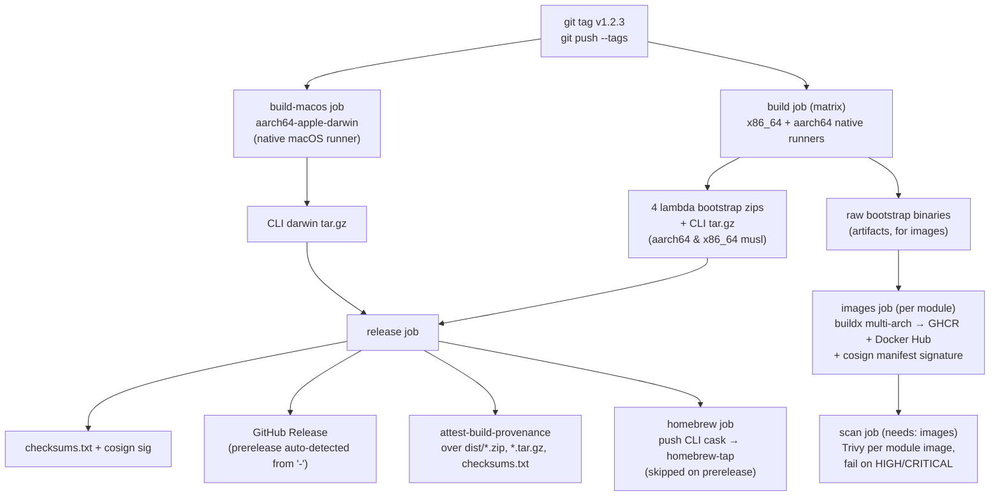

# Development

- [Everyday commands](#everyday-commands)
- [Makefile targets](#makefile-targets)
- [Integration tests (MiniStack)](#integration-tests-ministack)
- [CI](#ci)
- [Release process](#release-process)
- [Required repo secrets](#required-repo-secrets)
- [Contributing](#contributing)

## Everyday commands

```sh
cargo test --workspace --all-features
cargo clippy --workspace --all-targets --all-features -- -D warnings
cargo fmt --check
```

Every crate is `#![forbid(unsafe_code)]`; `core` has zero `aws-sdk-*`
dependencies by design — the hexagonal boundary is enforced by the crate graph,
not just convention.

First-time setup installs every dev/release tool and the musl cross-targets:

```sh
make install-tools
```

## Makefile targets

`make` (or `make help`) lists them all. The full set:

| Target                            | What it does                                                                   |
| --------------------------------- | ------------------------------------------------------------------------------ |
| `build`                           | Debug build of the whole workspace.                                            |
| `release`                         | Optimized release build (fat LTO, stripped) of every crate.                    |
| `lambda-build`                    | Cross-compile the four Lambda `bootstrap` binaries (needs cargo-lambda).        |
| `test`                            | Run the full test suite (all features).                                        |
| `clippy`                          | Lint with clippy, warnings as errors.                                          |
| `fmt` / `fmt-check`               | Format in place / verify formatting without writing.                           |
| `check`                           | Fast type-check without producing binaries.                                    |
| `ci`                              | Everything CI enforces: `fmt-check` + `clippy` + `test` + `audit`.             |
| `audit`                           | Scan dependencies for RUSTSEC advisories (needs cargo-audit).                  |
| `deny`                            | Check licenses, bans, advisories, sources via `deny.toml` (needs cargo-deny).  |
| `coverage`                        | Workspace coverage, HTML + lcov (needs cargo-llvm-cov + llvm-tools-preview).   |
| `release-musl`                    | Local static-musl release build of the whole workspace for one target.         |
| `validate`                        | Validate the example ruleset (prints always-bucket warnings).                  |
| `sample`                          | Show KEEP/DROP breakdown for the sample fixture.                               |
| `ministack-up` / `ministack-down` | Start / stop the local S3/SSM stack on `:4566`.                                |
| `ministack-test`                  | Run the `#[ignore]`d MiniStack tests (requires `ministack-up` first).          |
| `update` / `upgrade` / `outdated` | Dependency maintenance.                                                        |
| `install-tools`                   | Install every dev/release tool + rustup targets and components.                |
| `clean`                           | Remove the `target/` build directory.                                          |
| `tree-features`                   | Prove `lambda-s3` pulls in no other decoder feature (expect 0).                |

## Integration tests (MiniStack)

`crates/aws` and other crates have `#[ignore]`d tests that exercise the real AWS
SDK calls against [MiniStack](https://github.com/ministack-org/ministack) (a local
S3/SSM-compatible stack) instead of mocks. Bring it up first:

```sh
docker compose -f docker-compose.test.yml up -d
cargo test --workspace -- --ignored
# or: make ministack-up && make ministack-test
```

## CI

`.github/workflows/ci.yml` runs on every PR and push to `main`. Parallel jobs:

- **fmt** — `cargo fmt --check`.
- **clippy** — `cargo clippy … -D warnings`.
- **test** — `cargo test --workspace --all-features` with a coverage summary.
- **build** — static-musl `cargo build --workspace --release` on both arches
  (`x86_64` on `ubuntu-latest`, `aarch64` on the GitHub-hosted arm64 runner),
  the real release artifact path — no zig, no cross-linker. This is where the
  musl / `ring`-vs-`aws-lc-rs` breakage surfaces.
- **security** — `cargo audit` + `cargo deny check` + Trivy filesystem scan
  (advisory, `continue-on-error`).

`.github/workflows/codeql.yml` runs CodeQL (`language: rust`, `build-mode: none`)
on push/PR/weekly. `cargo-audit`/`cargo-deny` in CI are the reliable backstop.

## Release process

Cut a `v*` tag; everything else is automated by
[`.github/workflows/release.yml`](../.github/workflows/release.yml) — plain GitHub
Actions, no goreleaser and no zig.



Details:

- **build** — a 2-entry matrix builds every static-musl binary on its **native-arch
  runner** (`x86_64-unknown-linux-musl` on `ubuntu-latest`,
  `aarch64-unknown-linux-musl` on `ubuntu-24.04-arm`). No cross-linker: `musl-tools`
  supplies `musl-gcc` for `ring`'s C sources and rustc links musl self-contained.
  The 4 lambda crates each emit a `bootstrap` binary, so they build one at a time
  and the artifact is copied out before the next overwrites it. Uploads the release
  archives and the raw per-arch binaries.
- **build-macos** — the CLI's Apple Silicon (`aarch64-apple-darwin`) binary for the
  Homebrew cask, built on a **native `macos-14` runner** so `Security`/`CoreFoundation`
  link against the real Xcode SDK. This replaces the old zigbuild darwin
  cross-compile that failed for lack of a macOS SDK. Intel Macs are not targeted.
- **Arches** — `aarch64-unknown-linux-musl` + `x86_64-unknown-linux-musl` for all
  four lambdas and the CLI, plus `aarch64-apple-darwin` for the CLI (Homebrew only).
- **release** — merges every arch's archives (linux musl + darwin), writes one
  `checksums.txt`, cosign
  keyless `sign-blob`s it, then `softprops/action-gh-release` creates the GitHub
  Release with auto-generated notes (merged PRs since the previous tag + a Full
  Changelog link, like goreleaser's `changelog: use: github`); `prerelease` is set
  when the tag contains `-`. Provenance is attested over the archives + checksums.
- **images** — one multi-arch image per module. `docker buildx` stitches both
  arches from the pre-built binaries via the COPY-only
  [`docker/Dockerfile.lambda`](../docker/Dockerfile.lambda) on
  `gcr.io/distroless/static-debian13` (no QEMU), pushes `<module>-<version>` and
  `<module>-latest` (latest only on non-prerelease) to GHCR + Docker Hub, and cosign
  signs the manifest by digest.
- **homebrew** — renders the CLI cask from the darwin archive and pushes it to
  `github.com/<owner>/homebrew-tap` (`brew install <owner>/tap/cloudtrail-rs`), using
  the `HOMEBREW_TAP_TOKEN` PAT since the default `GITHUB_TOKEN` can't push to another
  repo. Skipped on prereleases so an `-rc` tag never moves the tap.
- **Supply chain** — cosign keyless (needs `id-token: write`) for the checksums and
  the image manifests; `attest-build-provenance` for the archive artifacts; Trivy
  scans each module image and fails on HIGH/CRITICAL.

Dry-run a release build locally before tagging (per target):

```sh
rustup target add x86_64-unknown-linux-musl   # once
make release-musl                             # MUSL_TARGET overrides the target
```

### Docker Hub namespace

GHCR uses `${{ github.repository_owner }}` (lowercased) so a fork stays correct.
The Docker Hub namespace comes from the `DOCKER_HUB_USER` secret.

## Required repo secrets

| Secret               | Purpose                                                     |
| -------------------- | ---------------------------------------------------------- |
| `DOCKER_HUB_USER`    | Docker Hub login + namespace for pushing images.           |
| `DOCKER_HUB_TOKEN`   | Docker Hub access token.                                   |
| `HOMEBREW_TAP_TOKEN` | PAT (repo scope on `homebrew-tap`) to push the CLI cask.   |

GHCR needs no extra secret beyond the automatic `GITHUB_TOKEN`. Cosign keyless
signing and build-provenance attestation use the workflow's OIDC identity
(`id-token: write`) — no long-lived signing key to manage.

## Contributing

1. Branch off `main`.
2. `make ci` must be green (`fmt-check` + `clippy` + `test` + `audit`).
3. If you touch rules/config behavior, run `make validate` and `make sample`.
4. Keep `#![forbid(unsafe_code)]` intact and `core` free of `aws-sdk-*` deps.
5. Open a PR; CI gates the same checks plus CodeQL and the security scan.

---

See also: [Deployment](deployment.md) · [Architecture](architecture.md) · [CLI](cli.md)
