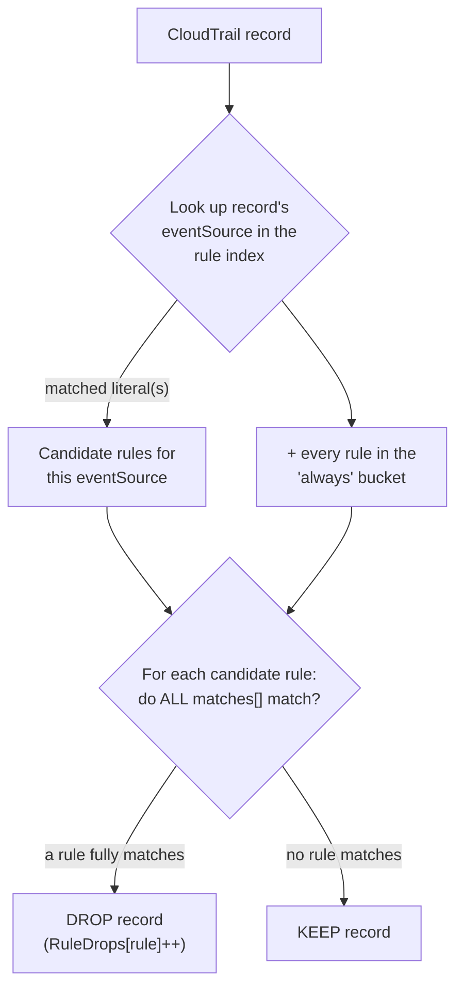

# Rules

The rules document lists exclusion rules. A CloudTrail record is **dropped** when
it matches any rule; a rule matches when **all** of its `matches[]` conditions
match. Rules that survive filtering are written to the destination.

- [Evaluation model](#evaluation-model)
- [Schema](#schema)
- [How a record is evaluated](#how-a-record-is-evaluated)
- [The rule index and the `always` bucket](#the-rule-index-and-the-always-bucket)
- [Validating a ruleset](#validating-a-ruleset)

## Evaluation model

- **AND within a rule** — every condition in `matches[]` must match the record.
- **OR across rules** — if _any_ rule matches, the record is dropped.

So a rule is a conjunction of field/regex tests, and the ruleset is a disjunction
of rules. Rules are exclusions: matching means "drop this noisy event".

## Schema

Modeled on [`examples/rules.example.yaml`](../examples/rules.example.yaml):

```yaml
version: 1.0.0 # semver — the rules schema version (see note below)

meta: # optional, informational only
  description: Example CloudTrail filtering rules for common AWS services
  author: security-team
  created_at: 2024-01-01
  updated_at: 2024-01-15
  tags: [production, security, cost-optimization]
  labels:
    environment: production
    team: security

rules:
  - name: EKS KMS Operations # unique, human-readable; used in metrics + CLI output
    matches: # AND — all conditions must match
      - field_name: eventName
        regex: "^(Decrypt|Encrypt|Sign|GenerateDataKey)$"
      - field_name: eventSource
        regex: "^kms\\.amazonaws\\.com$"
      - field_name: sourceIPAddress
        regex: "^eks\\.amazonaws\\.com$"
```

| Field                  | Meaning                                                                                                                                                                                       |
| ---------------------- | --------------------------------------------------------------------------------------------------------------------------------------------------------------------------------------------- |
| `version`              | Semver string identifying the rules schema (e.g. `1.0.0`). **This is semver — unlike the settings file's integer `version: 1`** (see [configuration.md](configuration.md#the-settings-file)). |
| `meta`                 | Optional free-form metadata (description, author, tags, labels). Not used for filtering.                                                                                                      |
| `rules[].name`         | Unique rule name. Must be unique — duplicate names are a validation error. Appears in `RuleDrops` metrics (dimension `Rule`) and in `test`/`filter` output.                                   |
| `rules[].matches[]`    | Non-empty list of conditions, AND-ed together. An empty `matches` is a validation error.                                                                                                      |
| `matches[].field_name` | Dotted path into the CloudTrail record (e.g. `userIdentity.sessionContext.sessionIssuer.arn`).                                                                                                |
| `matches[].regex`      | Rust-regex pattern the field's string value must match. Mind the [YAML quoting trap](configuration.md#the-yaml-quoting-trap).                                                                 |

> **`version` is semver here (`1.0.0`), integer in settings (`1`).** The two
> files use the same key name for different schemes; do not copy one into the
> other.

## How a record is evaluated



Only rules that _could_ apply to the record's `eventSource` are evaluated, plus
the `always` bucket — the rest are skipped entirely. This is what keeps
per-record cost low even with a large ruleset.

## The rule index and the `always` bucket

The rule index extracts literal `eventSource` values from each rule
(`^kms\.amazonaws\.com$` → one literal;
`^(cloudwatch|logs|ec2)\.amazonaws\.com$` → three) so that filtering a record
only checks the rules that could possibly apply to its `eventSource`, instead of
every rule.

Extraction is **conservative**. Any of these send a rule into a catch-all
`always` bucket that is checked against _every_ record, defeating the
optimization for that rule:

- inline flags (`(?i)`),
- character classes, quantifiers, nested groups,
- non-anchored patterns,
- **no `eventSource` condition at all**.

```yaml
# Falls into `always`: no anchors, index extraction gives up.
- name: KMS operations
  matches:
    - field_name: eventSource
      regex: "kms.amazonaws.com"

# Indexed: a single anchored literal.
- name: KMS operations
  matches:
    - field_name: eventSource
      regex: "^kms\\.amazonaws\\.com$"

# Also indexed: an anchored literal alternation.
- name: Monitoring services
  matches:
    - field_name: eventSource
      regex: "^(cloudwatch|logs|ec2)\\.amazonaws\\.com$"
```

Rules with no `eventSource` match at all (filtering purely on `eventName`,
`userIdentity.*`, etc.) are legitimate and will always land in `always` — the
warning is informational there, not necessarily something to fix.

## Validating a ruleset

[`cloudtrail-rs validate <rules-uri>`](cli.md#validate-uri) compiles the ruleset,
prints rule/pattern counts, and warns about every rule that landed in `always` —
that warning is your lever to get the speedup back. It exits non-zero only on an
actual config error (bad YAML, invalid semver, unresolvable regex, duplicate rule
name, empty `matches`), which is what CI should gate on.

Use [`cloudtrail-rs test <rules> <sample.json.gz>`](cli.md#test-rules-samplejsongz)
against a real sample to confirm rules fire as intended before shipping.

---

See also: [Configuration](configuration.md) · [CLI](cli.md) · [Architecture](architecture.md)
