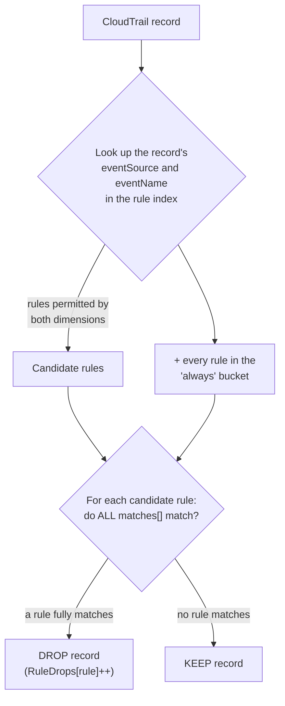

# Rules

The rules document lists exclusion rules. A CloudTrail record is **dropped** when
it matches any rule; a rule matches when **all** of its `matches[]` conditions
match. Rules that survive filtering are written to the destination.

- [Evaluation model](#evaluation-model)
- [Schema](#schema)
- [Schema v2](#schema-v2)
- [How a record is evaluated](#how-a-record-is-evaluated)
- [The rule index and the `always` bucket](#the-rule-index-and-the-always-bucket)
- [Validating a ruleset](#validating-a-ruleset)

## Evaluation model

- **AND within a rule** — every condition in `matches[]` must match the record.
- **OR across rules** — if _any_ rule matches, the record is dropped.

So a rule is a conjunction of field/regex tests, and the ruleset is a disjunction
of rules. Rules are exclusions: matching means "drop this noisy event".

## Schema

Modeled on [`examples/rules.example.yaml`](../examples/rules.example.yaml):

```yaml
version: 1.0.0 # semver — the rules schema version (see note below)

meta: # optional, informational only
  description: Example CloudTrail filtering rules for common AWS services
  author: security-team
  created_at: 2024-01-01
  updated_at: 2024-01-15
  tags: [production, security, cost-optimization]
  labels:
    environment: production
    team: security

rules:
  - name: EKS KMS Operations # unique, human-readable; used in metrics + CLI output
    matches: # AND — all conditions must match
      - field_name: eventName
        regex: "^(Decrypt|Encrypt|Sign|GenerateDataKey)$"
      - field_name: eventSource
        regex: "^kms\\.amazonaws\\.com$"
      - field_name: sourceIPAddress
        regex: "^eks\\.amazonaws\\.com$"
```

| Field                  | Meaning                                                                                                                                                                                       |
| ---------------------- | --------------------------------------------------------------------------------------------------------------------------------------------------------------------------------------------- |
| `version`              | Semver string identifying the rules schema (e.g. `1.0.0`). **This is semver — unlike the settings file's integer `version: 1`** (see [configuration.md](configuration.md#the-settings-file)). |
| `meta`                 | Optional free-form metadata (description, author, tags, labels). Not used for filtering.                                                                                                      |
| `rules[].name`         | Unique rule name. Must be unique — duplicate names are a validation error. Appears in `RuleDrops` metrics (dimension `Rule`) and in `test`/`filter` output.                                   |
| `rules[].matches[]`    | Non-empty list of conditions, AND-ed together. An empty `matches` is a validation error.                                                                                                      |
| `matches[].field_name` | Dotted path into the CloudTrail record (e.g. `userIdentity.sessionContext.sessionIssuer.arn`).                                                                                                |
| `matches[].regex`      | Rust-regex pattern the field's string value must match. Mind the [YAML quoting trap](configuration.md#the-yaml-quoting-trap).                                                                 |

> **`version` is semver here (`1.0.0`), integer in settings (`1`).** The two
> files use the same key name for different schemes; do not copy one into the
> other.

## Schema v2

Version `2.x` replaces `field_name`/`regex` with `field` plus exactly one of
four operators, and an optional `negate`. v1 documents (`version: 1.x`,
`field_name`/`regex` only) keep evaluating unchanged: v1's `field_name` is a
literal dotted key path, with no subscript or wildcard syntax — v2's `field`
is what adds them. Migrating to v2 is optional, not forced.

```yaml
version: 2.0.0

rules:
  - name: Automated Tool Describe Operations
    matches:
      - field: eventName
        regex: "^Describe.*$"
      - field: readOnly
        equals: "true"
      - field: userAgent
        any_of: ["aws-cli", "boto3"]
      - field: errorCode
        absent: true
      - field: resources[*].ARN
        equals: "arn:aws:s3:::noisy-bucket"
        negate: true
```

> **The wildcard cliff.** A single `[*]` anywhere in the ruleset — like
> `resources[*].ARN` above — disables the projected-parse optimization for
> the _whole_ ruleset, not just that rule: every record is now fully parsed
> instead of only the fields rules reference. Functionally identical, just
> slower; worth knowing before copying this example into a large ruleset.

| Field              | Meaning                                                                                                                                                                                       |
| ------------------ | --------------------------------------------------------------------------------------------------------------------------------------------------------------------------------------------- |
| `matches[].field`  | Dotted path, like v1's `field_name`, plus optional array subscripts: `resources[0].ARN` indexes one element, `resources[*].ARN` matches if _any_ element does.                                |
| `matches[].regex`  | Same as v1: a Rust-regex pattern the resolved value must match.                                                                                                                               |
| `matches[].equals` | The resolved value must equal this string exactly — no regex, no partial match.                                                                                                               |
| `matches[].any_of` | The resolved value must equal one of these strings. Must not be empty.                                                                                                                        |
| `matches[].absent` | `true`: the field must resolve to nothing (missing, `null`, or a non-scalar). `false`: it must resolve to a scalar. The only way to express "this field was never set" — inexpressible in v1. |
| `matches[].negate` | Optional, default `false`. Inverts this one condition before the rule ANDs it with the others.                                                                                                |

Exactly one of `regex` / `equals` / `any_of` / `absent` must be set per match;
zero or more than one is a validation error at load, same tier as an
uncompilable regex or an empty `matches` list.

## How a record is evaluated


```mermaid
flowchart TD
    REC["CloudTrail record"] --> IDX{"Look up the record's<br/>eventSource and eventName<br/>in the rule index"}
    IDX -->|"rules permitted by<br/>both dimensions"| SUB["Candidate rules"]
    IDX --> ALW["+ every rule in the<br/>'always' bucket"]
    SUB --> EVAL
    ALW --> EVAL
    EVAL{"For each candidate rule:<br/>do ALL matches[] match?"}
    EVAL -->|"a rule fully matches"| DROP["DROP record<br/>(RuleDrops[rule]++)"]
    EVAL -->|"no rule matches"| KEEP["KEEP record"]
```

Only rules that _could_ apply to the record's `eventSource` and `eventName` are
evaluated, plus the `always` bucket — the rest are skipped entirely. This is
what keeps per-record cost low even with a large ruleset.

## The rule index and the `always` bucket

The index has two dimensions, `eventSource` and `eventName`. For each rule it
extracts the literal values that rule restricts each field to, so filtering a
record only checks the rules that could possibly apply to it. Constraining
either field is enough; constraining both narrows further.

`equals` and `any_of` supply their literals directly. A `regex` supplies
literals only when the pattern is an anchored alternation of plain strings
(`^kms\.amazonaws\.com$` → one literal;
`^(cloudwatch|logs|ec2)\.amazonaws\.com$` → three).

Extraction is **conservative**: a rule is only skipped when the index can prove
it cannot fire. A rule constrained on neither field lands in a catch-all
`always` bucket that is checked against _every_ record, defeating the
optimization for that rule. These are the ways a condition fails to yield
literals:

- a `regex` with inline flags (`(?i)`), character classes, quantifiers, nested
  groups, or no anchors,
- `absent` — it says the field has no value, which narrows nothing,
- `negate: true` on the condition — it says which values must _not_ appear,
  which excludes nothing,
- a condition on a nested path (`userIdentity.type`) rather than on
  `eventSource` or `eventName` itself.

```yaml
# Falls into `always`: no anchors, index extraction gives up.
- name: KMS operations
  matches:
    - field: eventSource
      regex: "kms.amazonaws.com"

# Indexed: a single anchored literal.
- name: KMS operations
  matches:
    - field: eventSource
      regex: "^kms\\.amazonaws\\.com$"

# Also indexed: an anchored literal alternation.
- name: Monitoring services
  matches:
    - field: eventSource
      regex: "^(cloudwatch|logs|ec2)\\.amazonaws\\.com$"

# Also indexed, on both dimensions, without a regex.
- name: KMS decrypts
  matches:
    - field: eventSource
      equals: kms.amazonaws.com
    - field: eventName
      any_of: ["Decrypt", "GenerateDataKey"]

# Indexed on eventName alone: no eventSource condition is fine.
- name: Console logins
  matches:
    - field: eventName
      equals: ConsoleLogin
```

Rules that constrain neither field (filtering purely on `userIdentity.*`,
`userAgent`, etc.) are legitimate and will always land in `always` — the warning
is informational there, not necessarily something to fix.

## Validating a ruleset

[`cloudtrail-rs validate <rules-uri>`](cli.md#validate-uri) compiles the ruleset,
prints rule/pattern counts, and warns about every rule that landed in `always` —
that warning is your lever to get the speedup back. By default it exits non-zero
only on an actual config error (bad YAML, invalid semver, unresolvable regex,
duplicate rule name, empty `matches`), which is the minimum CI should gate on.

Pass `--max-unindexed <PERCENT>` to also fail when too large a fraction of the
ruleset landed in `always`, so a ruleset that silently loses its index fails CI
instead of quietly getting slower.

Use [`cloudtrail-rs test <rules> <sample.json.gz>`](cli.md#test-rules-samplejsongz)
against a real sample to confirm rules fire as intended before shipping.

---

See also: [Configuration](configuration.md) · [CLI](cli.md) · [Architecture](architecture.md)
